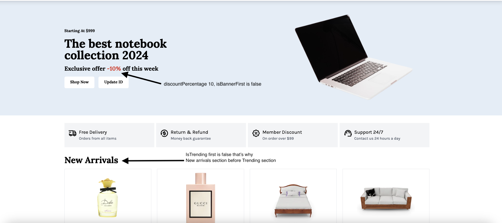
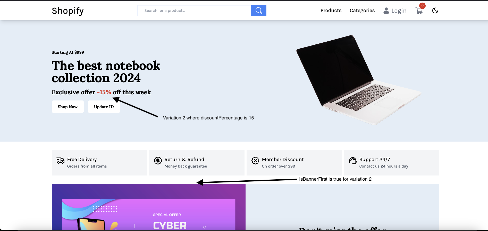
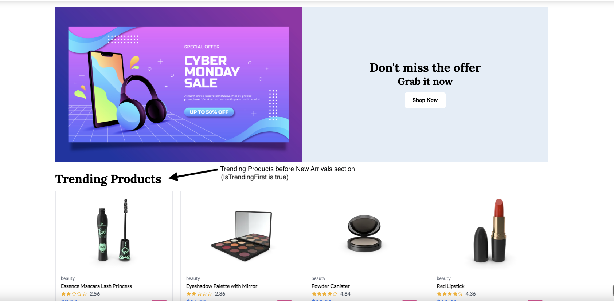

# Shopify - a simple eCommerce app

This is a basic demo e-commerce application built with React, TypeScript, Tailwind CSS, Vite, and Redux Toolkit. It serves to demonstrate typical features found in e-commerce platforms, such as a homepage, product listings, shopping cart, and user-authenticated sections like account and wishlist pages. Additionally, it incorporates the VWO FME React SDK to support feature management and experimentation.

## ✨ Features

- **Homepage:** Introduce users to your e-commerce platform with attractive banners, featured products, and navigation options.
- **Product Page:** Display a catalog of products with detailed information, including images, descriptions, and pricing.
- **Cart:** Allow users to add products to their cart, view cart contents, and proceed to checkout.
- **User Authentication:** Enable users to create accounts, log in, and access personalized features like wishlists and account settings.
- **Wishlist:** Allow users to save products they're interested in for future reference.
- **Feature Management:** Integrated VWO FME React SDK for feature flag management and A/B testing capabilities.


## 🚀 Prerequisites

Before you begin, ensure you have:

- Node.js (v12 or higher)
- React.js (v16.8.0 or higher)
- Feature Management and Experimentation(FME) product enabled for your VWO account

## 💻 Installation

1. Clone this repository to your local machine.
2. Change directory

  ```bash
  cd vwo-fme-examples/react-web-ecommerce-app
  ```

3. Install dependencies using `npm install` or `yarn install`.
4. Set up your WO FME credentials in the environment variables:

    - Create a `.env` file in the root directory
    - Add the following environment variables:

      ```bash
      VITE_VWO_ACCOUNT_ID=vwo_account_id
      VITE_VWO_SDK_KEY=vwo_sdk_key
      VITE_VWO_LOG_LEVEL=vwo_log_level
      VITE_VWO_FLAG_KEY_1=vwo_flag_key_1
      VITE_VWO_FLAG_KEY_2=vwo_flag_key_2
      VITE_VWO_USER_ID=vwo_user_id
      VITE_VWO_EVENT_KEY=vwo_event_key
      VITE_VWO_FLAG1_NUMBER_VARIABLE_KEY=vwo_flag1_number_variable_key
      VITE_VWO_FLAG1_BOOLEAN_VARIABLE_KEY=vwo_flag1_boolean_variable_key
      VITE_VWO_FLAG2_BOOLEAN_VARIABLE_KEY=vwo_flag2_boolean_variable_key
      ```

5. Start the development server using `npm run dev` or `yarn dev`.
6. Open your browser and navigate to `http://localhost:5173` to view the application.

### Steps to Implement

1. **Create 2 Feature Flags in VWO FME:**
   - **Name:** `FME Example Flag 1`
     - **Variables:**
       - `discountPercentage`: Number variable for controlling discount rates
       - `isBannerFirst`: Boolean variable for banner placement
   - **Name:** `FME Example Flag 2`
     - **Variables:**
       - `isTrendingFirst`: Boolean variable for trending section placement

## ✨ Use Cases

This example demonstrates powerful use cases of feature flag control in an e-commerce application:

### 1. Dynamic Discount Management

**Feature Flag:** VWO_FLAG_KEY_1

- **Use Case:** Controls discount percentages and banner placement
- **Variables:**
  - `discountPercentage`: Number variable (0-100)
  - `isBannerFirst`: Boolean variable
- **Variations:**
  - **Control:**

    ```json
    "discountPercentage": 10,
    "isBannerFirst": false
    ```

  - **Variation 1:**

    ```json
      "discountPercentage": 20,
      "isBannerFirst": true
    ```

  - **Variation 2:**

    ```json
      "discountPercentage": 15,
      "isBannerFirst": true
    ```

### 2. Content Layout Optimization

**Feature Flag:** VWO_FLAG_KEY_2

- **Use Case:** Controls the placement of trending products section
- **Variables:**
  - `isTrendingFirst`: Boolean variable
- **Variations:**
  - **Control:** (Trending section at top)

    ```json
      "isTrendingFirst" : true
    ```

  - **Variation 1:** (Trending section at below)

    ```json
      "isTrendingFirst" : false
    ```

### 3. Event Tracking

**Event Key:** `eventWithProperties`

- **Use Case:** Tracks user interactions with feature flag variations
- **Properties Tracked:**
  - User ID
  - Feature flag states
  - Interaction timestamps
  - User preferences

### Implementation Details

1. **User Context:**
   - The app uses a unique user ID for feature flag evaluation
   - User context is set in the VWOProviderWrapper component
   - Example: `id: 'RandomUserID'`

2. **Feature Flag Usage:**
   - Feature flags are evaluated at runtime
   - Changes are reflected immediately without page reload
   - Logging is enabled for debugging purposes

3. **Event Tracking:**
   - Cart additions
   - Product views
   - Wishlist interactions
   - Checkout process steps

## 📸 Screenshots

Here are some screenshots demonstrating the feature flag variations in action:

1. **Feature Flag 1 - Control Variation**
   - Shows the default discount percentage (10%) and banner placement

   

2. **Feature Flag 1 - Variation 2**
   - Demonstrates increased discount percentage (15%) and modified banner placement

   

3. **Feature Flag 2 - Control Variation**
   - Shows the default trending section placement at the top of the page
   - Demonstrates the `isTrendingFirst` variable set to true

   

4. **Feature Flag 2 - Variation 1**
   - Shows the trending section moved below other content
   - Demonstrates the `isTrendingFirst` variable set to false

   

## Credits

This project was inspired by [simple-react-ecommerce](https://github.com/alim1496/simple-react-ecommerce) under MIT License. We used it as a foundation to build our own sample application with VWO FME integrated and extend its functionality for demonstration purposes.
# jsjs
